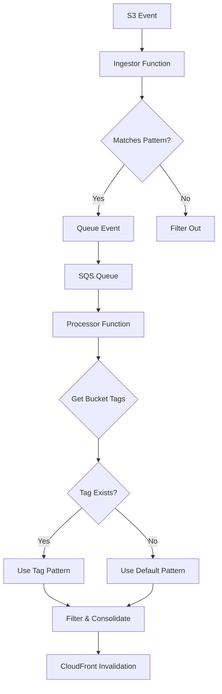

# Design Document: Origin Path Pattern

## Overview

The origin-path-pattern feature extends the CloudFront cache invalidation system to support configurable S3 bucket path structures. Currently, the system is hardcoded to work with the `/{stageId}/public` pattern. This design introduces flexibility through CloudFormation parameters, bucket tags, and dynamic path depth calculation while maintaining backward compatibility.

### Key Design Principles

1. **Backward Compatibility**: Default behavior remains unchanged (`/{stageId}/public`)
2. **Configuration Hierarchy**: Bucket tags override application-level settings
3. **Dynamic Calculation**: Path depth is calculated at runtime, not hardcoded
4. **Validation First**: Invalid patterns are rejected at deployment time
5. **Minimal Changes**: Leverage existing architecture and patterns

### Architecture Impact

This feature affects three main components:
- **CloudFormation Template**: New parameter with validation
- **Ingestor Function**: Pattern matching for event filtering
- **Processor Function**: Pattern resolution, stage filtering, and dynamic consolidation

## Architecture

### Component Interaction Flow



### Configuration Hierarchy

```
1. Bucket Tag (invalidator:OriginPathPattern) - Highest Priority
   ↓
2. CloudFormation Parameter (OriginPathPattern)
   ↓
3. Constants.py Default (/{stageId}/public) - Lowest Priority
```

### Pattern Matching Strategy

The system uses a three-tier matching strategy:

1. **Exact Pattern Match**: Event path matches the configured pattern exactly
2. **Public Segment Fallback**: Event path contains "public" segment (for backward compatibility)
3. **Stage Filtering**: Non-production stages are filtered based on pattern configuration

## Components and Interfaces

### 1. CloudFormation Template Changes

#### New Parameter

```yaml
Parameters:
  OriginPathPattern:
    Type: String
    Default: "/{stageId}/public"
    Description: >
      Origin path pattern for S3 bucket structure. Use {stageId} as placeholder 
      for stage identifiers. Must start with / and not end with /. 
      Examples: /{stageId}/public, /public, /{stageId}/assets
    AllowedPattern: ^$|^/([a-zA-Z0-9\-_{}]+(/[a-zA-Z0-9\-_{}]+)*)?$
    ConstraintDescription: >
      Must start with /, not end with /, and only use {stageId} placeholder. 
      Valid characters: a-z, A-Z, 0-9, -, _, {, }
```

#### Environment Variable Mapping

```yaml
IngestorFunction:
  Environment:
    Variables:
      ORIGIN_PATH_PATTERN: !Ref OriginPathPattern

ProcessorFunction:
  Environment:
    Variables:
      ORIGIN_PATH_PATTERN: !Ref OriginPathPattern
```

### 2. Constants Module (`constants.py`)

```python
# Origin path pattern configuration
ORIGIN_PATH_PATTERN = os.environ.get('ORIGIN_PATH_PATTERN', '/{stageId}/public')
PUBLIC_PATH_SEGMENT = 'public'

# Stage identifiers
PRODUCTION_STAGE_IDENTIFIERS = ['prod', 'beta', 'stage', 'staging']
NON_PRODUCTION_STAGE_IDENTIFIERS = ['dev', 'test']

# Remove: ORIGIN_PATH_DEPTH (no longer needed)
```

### 3. Path Utilities Module (`path_utils.py`)

New utility module in the Lambda layer:

```python
def calculate_path_depth(path: str) -> int:
    """
    Calculate the depth of a path by counting segments.
    
    Args:
        path: Path string (e.g., '/{stageId}/public' or '/prod/public')
    
    Returns:
        Number of path segments (e.g., 2 for '/{stageId}/public')
    """
    # Remove leading/trailing slashes and split
    segments = [s for s in path.strip('/').split('/') if s]
    return len(segments)

def matches_pattern(event_path: str, pattern: str, stage_ids: list) -> tuple[bool, str]:
    """
    Check if an event path matches the origin path pattern.
    
    Args:
        event_path: S3 object key from event
        pattern: Origin path pattern (may contain {stageId})
        stage_ids: List of valid stage identifiers
    
    Returns:
        Tuple of (matches: bool, resolved_stage: str or None)
    """
    # If pattern has {stageId}, try to match with each stage identifier
    if '{stageId}' in pattern:
        for stage_id in stage_ids:
            resolved_pattern = pattern.replace('{stageId}', stage_id)
            if event_path.startswith(resolved_pattern + '/'):
                return True, stage_id
        return False, None
    else:
        # Pattern has no placeholder, direct match
        if event_path.startswith(pattern + '/'):
            return True, None
        return False, None

def derive_pattern_from_path(event_path: str, public_segment: str, 
                             prod_stages: list, non_prod_stages: list) -> str:
    """
    Derive origin path pattern from an event path containing public segment.
    
    Args:
        event_path: S3 object key
        public_segment: Public directory name (e.g., 'public')
        prod_stages: Production stage identifiers
        non_prod_stages: Non-production stage identifiers
    
    Returns:
        Derived pattern (e.g., '/{stageId}/public' or '/public')
    """
    segments = event_path.strip('/').split('/')
    
    # Find public segment index
    try:
        public_index = segments.index(public_segment)
    except ValueError:
        return ''
    
    # Extract path up to and including public
    path_segments = segments[:public_index + 1]
    
    # Replace stage identifiers with {stageId}
    normalized_segments = []
    for segment in path_segments:
        if segment in prod_stages or segment in non_prod_stages:
            normalized_segments.append('{stageId}')
        else:
            normalized_segments.append(segment)
    
    return '/' + '/'.join(normalized_segments)

def extract_stage_from_path(event_path: str, pattern: str) -> str:
    """
    Extract stage identifier from event path using pattern.
    
    Args:
        event_path: S3 object key
        pattern: Origin path pattern with {stageId} placeholder
    
    Returns:
        Stage identifier or empty string if not found
    """
    if '{stageId}' not in pattern:
        return ''
    
    # Split pattern and path into segments
    pattern_segments = pattern.strip('/').split('/')
    path_segments = event_path.strip('/').split('/')
    
    # Find {stageId} position in pattern
    try:
        stage_index = pattern_segments.index('{stageId}')
        if stage_index < len(path_segments):
            return path_segments[stage_index]
    except (ValueError, IndexError):
        pass
    
    return ''
```

### 4. Ingestor Function Changes

```python
def should_process_event(event_path: str) -> bool:
    """
    Determine if an S3 event should be queued for processing.
    
    Logic:
    1. Try exact pattern match with production stages
    2. Fall back to public segment detection
    3. Filter non-production stages
    """
    from constants import (
        ORIGIN_PATH_PATTERN, 
        PUBLIC_PATH_SEGMENT,
        PRODUCTION_STAGE_IDENTIFIERS,
        NON_PRODUCTION_STAGE_IDENTIFIERS
    )
    from path_utils import matches_pattern, derive_pattern_from_path
    
    # Try exact pattern match
    all_stages = PRODUCTION_STAGE_IDENTIFIERS + NON_PRODUCTION_STAGE_IDENTIFIERS
    matches, stage = matches_pattern(event_path, ORIGIN_PATH_PATTERN, all_stages)
    
    if matches:
        # If pattern has {stageId}, only allow production stages
        if '{stageId}' in ORIGIN_PATH_PATTERN:
            return stage in PRODUCTION_STAGE_IDENTIFIERS
        else:
            # No stage placeholder, treat as production
            return True
    
    # Fallback: Check for public segment
    if PUBLIC_PATH_SEGMENT in event_path:
        segments = event_path.strip('/').split('/')
        try:
            public_index = segments.index(PUBLIC_PATH_SEGMENT)
            # Check if any non-prod stage appears before public
            for i in range(public_index):
                if segments[i] in NON_PRODUCTION_STAGE_IDENTIFIERS:
                    return False
            return True
        except ValueError:
            pass
    
    return False
```

### 5. Processor Function Changes

#### Pattern Resolution

```python
def resolve_bucket_pattern(bucket_name: str, sample_event_path: str) -> str:
    """
    Determine the origin path pattern for a bucket.
    
    Priority:
    1. Bucket tag (invalidator:OriginPathPattern)
    2. Pattern match with ORIGIN_PATH_PATTERN
    3. Derive from public segment placement
    """
    from constants import (
        ORIGIN_PATH_PATTERN,
        PUBLIC_PATH_SEGMENT,
        PRODUCTION_STAGE_IDENTIFIERS,
        NON_PRODUCTION_STAGE_IDENTIFIERS
    )
    from path_utils import matches_pattern, derive_pattern_from_path
    
    # Check bucket tag
    s3_client = boto3.client('s3')
    try:
        response = s3_client.get_bucket_tagging(Bucket=bucket_name)
        for tag in response.get('TagSet', []):
            if tag['Key'] == 'invalidator:OriginPathPattern':
                return tag['Value']
    except ClientError as e:
        if e.response['Error']['Code'] != 'NoSuchTagSet':
            raise
    
    # Try pattern match
    all_stages = PRODUCTION_STAGE_IDENTIFIERS + NON_PRODUCTION_STAGE_IDENTIFIERS
    matches, _ = matches_pattern(sample_event_path, ORIGIN_PATH_PATTERN, all_stages)
    if matches:
        return ORIGIN_PATH_PATTERN
    
    # Derive from public segment
    derived = derive_pattern_from_path(
        sample_event_path,
        PUBLIC_PATH_SEGMENT,
        PRODUCTION_STAGE_IDENTIFIERS,
        NON_PRODUCTION_STAGE_IDENTIFIERS
    )
    
    return derived if derived else ORIGIN_PATH_PATTERN
```

#### Event Filtering

```python
def filter_events_by_pattern(events: list, bucket_pattern: str) -> list:
    """
    Filter events that match the bucket's origin path pattern.
    
    Returns only events that:
    1. Match the bucket pattern
    2. Are production stages (if pattern has {stageId})
    """
    from constants import (
        PRODUCTION_STAGE_IDENTIFIERS,
        NON_PRODUCTION_STAGE_IDENTIFIERS
    )
    from path_utils import matches_pattern, extract_stage_from_path
    
    filtered = []
    all_stages = PRODUCTION_STAGE_IDENTIFIERS + NON_PRODUCTION_STAGE_IDENTIFIERS
    
    for event in events:
        event_path = event['s3']['object']['key']
        
        # Check pattern match
        matches, stage = matches_pattern(event_path, bucket_pattern, all_stages)
        if not matches:
            continue
        
        # Stage filtering
        if '{stageId}' in bucket_pattern:
            if stage and stage in PRODUCTION_STAGE_IDENTIFIERS:
                filtered.append(event)
        else:
            # No stage placeholder, treat as production
            filtered.append(event)
    
    return filtered
```

#### Dynamic Consolidation

```python
def consolidate_paths(event_paths: list, bucket_pattern: str) -> dict:
    """
    Consolidate invalidation paths dynamically based on bucket pattern.
    
    Returns:
        Dictionary mapping stage -> list of consolidated paths
    """
    from path_utils import calculate_path_depth, extract_stage_from_path
    
    # Calculate depth from pattern
    pattern_depth = calculate_path_depth(bucket_pattern)
    
    # Group paths by stage
    stage_paths = {}
    for path in event_paths:
        stage = extract_stage_from_path(path, bucket_pattern)
        stage_key = stage if stage else 'default'
        
        if stage_key not in stage_paths:
            stage_paths[stage_key] = []
        stage_paths[stage_key].append(path)
    
    # Consolidate each stage separately
    consolidated = {}
    for stage, paths in stage_paths.items():
        consolidated[stage] = _consolidate_stage_paths(paths, pattern_depth)
    
    return consolidated

def _consolidate_stage_paths(paths: list, depth: int) -> list:
    """
    Consolidate paths for a single stage using existing logic.
    
    Uses the same consolidation algorithm as before, but with dynamic depth.
    """
    # Existing consolidation logic from processor.py
    # Modified to use dynamic depth parameter instead of ORIGIN_PATH_DEPTH
    pass
```

## Data Models

### Configuration Data

```python
@dataclass
class OriginPathConfig:
    """Configuration for origin path pattern handling"""
    pattern: str  # e.g., '/{stageId}/public'
    depth: int    # Calculated depth
    has_stage_placeholder: bool
    
    @classmethod
    def from_pattern(cls, pattern: str) -> 'OriginPathConfig':
        return cls(
            pattern=pattern,
            depth=calculate_path_depth(pattern),
            has_stage_placeholder='{stageId}' in pattern
        )
```

### Event Processing Data

```python
@dataclass
class ProcessingContext:
    """Context for processing a batch of events"""
    bucket_name: str
    bucket_pattern: str
    events: list
    filtered_events: list
    consolidated_paths: dict  # stage -> paths
```

### Pattern Match Result

```python
@dataclass
class PatternMatchResult:
    """Result of pattern matching operation"""
    matches: bool
    stage: Optional[str]
    resolved_pattern: Optional[str]
```


## Correctness Properties

*A property is a characteristic or behavior that should hold true across all valid executions of a system—essentially, a formal statement about what the system should do. Properties serve as the bridge between human-readable specifications and machine-verifiable correctness guarantees.*

### Property 1: Pattern Validation Completeness

*For any* origin path pattern string, the CloudFormation parameter validation should accept it if and only if it: starts with `/`, does not end with `/`, contains only valid path characters (a-z, A-Z, 0-9, -, _, {, }), and any curly braces only wrap the literal text `stageId`.

**Validates: Requirements 1.3, 1.4, 1.5, 1.6, 11.1, 11.2, 11.3, 11.4**

### Property 2: Environment Variable Precedence

*For any* non-empty ORIGIN_PATH_PATTERN environment variable value, the Lambda functions should use that value instead of the constants.py default.

**Validates: Requirements 2.3**

### Property 3: Path Depth Calculation

*For any* path string, the depth calculation function should return a count equal to the number of non-empty segments when split by `/`.

**Validates: Requirements 3.6, 9.2**

### Property 4: Bucket Tag Priority

*For any* bucket with an `invalidator:OriginPathPattern` tag, the Processor function should use the tag value as the bucket pattern regardless of whether the event path matches ORIGIN_PATH_PATTERN.

**Validates: Requirements 4.2, 6.2**

### Property 5: Production Stage Filtering with Placeholder

*For any* origin path pattern containing `{stageId}` and any event path, the Ingestor and Processor functions should queue/allow the event if and only if the extracted stage identifier is in PRODUCTION_STAGE_IDENTIFIERS.

**Validates: Requirements 5.1, 7.1, 7.2**

### Property 6: Pattern Without Placeholder Accepts All

*For any* origin path pattern that does not contain `{stageId}` and any matching event path, the Ingestor and Processor functions should queue/allow the event regardless of stage identifiers present in the path.

**Validates: Requirements 5.2, 7.3**

### Property 7: Public Segment Fallback Filtering

*For any* event path that does not match ORIGIN_PATH_PATTERN but contains PUBLIC_PATH_SEGMENT, the Ingestor function should queue the event if and only if no NON_PRODUCTION_STAGE_IDENTIFIERS appear in path segments before the PUBLIC_PATH_SEGMENT.

**Validates: Requirements 5.3, 5.5**

### Property 8: Non-Matching Path Rejection

*For any* event path that neither matches ORIGIN_PATH_PATTERN nor contains PUBLIC_PATH_SEGMENT, the Ingestor function should filter out the event.

**Validates: Requirements 5.4**

### Property 9: Pattern Derivation with Stage Normalization

*For any* event path containing PUBLIC_PATH_SEGMENT and any stage identifier from PRODUCTION_STAGE_IDENTIFIERS or NON_PRODUCTION_STAGE_IDENTIFIERS, the derive_pattern_from_path function should replace the stage identifier with `{stageId}` placeholder in the derived pattern.

**Validates: Requirements 6.4, 6.5**

### Property 10: Tag Mismatch Filtering

*For any* bucket with an `invalidator:OriginPathPattern` tag and any event path that does not match the tag pattern, the Processor function should filter out the event.

**Validates: Requirements 6.6**

### Property 11: Path Filtering by Bucket Pattern

*For any* set of events for a bucket and the bucket's resolved origin path pattern, the Processor function should filter out all events whose object paths do not match the bucket pattern.

**Validates: Requirements 8.1**

### Property 12: Dynamic Depth in Consolidation

*For any* bucket origin path pattern, the consolidation function should calculate depth from the pattern and use that depth to determine the root path for consolidation, not a hardcoded constant.

**Validates: Requirements 9.1, 9.3**

### Property 13: Multi-Stage Separation

*For any* set of event paths containing multiple distinct stage identifiers, the consolidation function should create separate invalidation requests for each stage.

**Validates: Requirements 9.4**

## Error Handling

### CloudFormation Validation Errors

**Pattern Validation Failures**:
- Pattern not starting with `/`: Return constraint description with valid format
- Pattern ending with `/`: Return constraint description with valid format
- Invalid curly brace usage: Return constraint description explaining `{stageId}` requirement
- Invalid path characters: Return constraint description with allowed characters

**Deployment-Time Errors**:
- Empty parameter value: Fall back to constants.py default
- Missing environment variable: Fall back to constants.py default

### Runtime Errors

**S3 Tag Retrieval Errors**:
- `NoSuchTagSet`: Continue with fallback pattern resolution
- `AccessDenied`: Log error and continue with fallback pattern resolution
- Other S3 errors: Log error, use ORIGIN_PATH_PATTERN as fallback

**Pattern Matching Errors**:
- Invalid pattern format: Log warning, filter out event
- Unable to derive pattern: Log warning, use ORIGIN_PATH_PATTERN as fallback

**Consolidation Errors**:
- Empty filtered event list: Skip consolidation, log info message
- Invalid path structure: Log warning, skip problematic paths
- CloudFront API errors: Retry with exponential backoff (existing behavior)

### Error Logging Strategy

All errors should include:
- Bucket name
- Event path (if applicable)
- Pattern being used
- Error type and message
- Recommended action

## Testing Strategy

### Unit Testing Approach

Unit tests focus on specific examples, edge cases, and error conditions:

**CloudFormation Template Tests**:
- Verify parameter exists with correct default
- Test specific invalid patterns (e.g., `public`, `/public/`, `/{stage}/public`)
- Verify environment variable mapping to both Lambda functions

**Constants Module Tests**:
- Verify default values for all constants
- Verify ORIGIN_PATH_DEPTH constant is removed
- Test environment variable override with specific values

**Path Utilities Tests**:
- Test depth calculation with specific paths (e.g., `/`, `/public`, `/{stageId}/public`)
- Test pattern matching with specific combinations
- Test pattern derivation with specific paths
- Test stage extraction with specific patterns

**Ingestor Function Tests**:
- Test specific pattern matches (e.g., `/prod/public/file.html` with `/{stageId}/public`)
- Test specific fallback cases (e.g., `/prod/public/file.html` with pattern `/public`)
- Test specific filtering cases (e.g., `/dev/public/file.html` should be filtered)

**Processor Function Tests**:
- Test bucket tag retrieval with mocked boto3
- Test pattern resolution priority with specific scenarios
- Test event filtering with specific event sets
- Test consolidation with specific path sets

**Error Handling Tests**:
- Test NoSuchTagSet exception handling
- Test empty event list handling
- Test invalid pattern handling

### Property-Based Testing Approach

Property tests verify universal properties across randomized inputs. Given the testing guidelines for this project, property-based tests should be **minimal and focused on core validation logic only**.

**Priority Property Tests** (implement these):

1. **Pattern Validation Completeness** (Property 1)
   - Generate random pattern strings
   - Verify validation accepts/rejects according to rules
   - **Iterations**: 20 (minimal, covers validation logic)

2. **Path Depth Calculation** (Property 3)
   - Generate random paths with varying segment counts
   - Verify depth equals segment count
   - **Iterations**: 20 (minimal, covers core utility)

3. **Stage Filtering Consistency** (Property 5)
   - Generate random stage identifiers and paths
   - Verify production stages pass, non-production filtered
   - **Iterations**: 20 (minimal, covers filtering logic)

**Optional Property Tests** (skip for faster development):

- Environment Variable Precedence (Property 2) - covered by unit tests
- Bucket Tag Priority (Property 4) - covered by unit tests with mocking
- Pattern Without Placeholder (Property 6) - covered by unit tests
- Public Segment Fallback (Property 7) - covered by unit tests
- Non-Matching Path Rejection (Property 8) - covered by unit tests
- Pattern Derivation (Property 9) - covered by unit tests
- Tag Mismatch Filtering (Property 10) - covered by unit tests
- Path Filtering (Property 11) - covered by unit tests
- Dynamic Depth in Consolidation (Property 12) - covered by unit tests
- Multi-Stage Separation (Property 13) - covered by unit tests

### Integration Testing

**End-to-End Flow Tests**:
- Deploy CloudFormation stack with custom pattern
- Trigger S3 events with various paths
- Verify correct CloudFront invalidations
- Test with bucket tags override

**Backward Compatibility Tests**:
- Deploy with default parameters
- Run existing test suite
- Verify identical behavior to previous version

### Test Organization

```
tests/
├── unit/
│   ├── test_template.py          # CloudFormation template validation
│   ├── test_constants.py         # Constants module tests
│   ├── test_path_utils.py        # Path utility functions
│   ├── test_ingestor.py          # Ingestor function logic
│   ├── test_processor.py         # Processor function logic
│   └── test_consolidation.py     # Consolidation logic
├── property/                      # Minimal property-based tests
│   ├── test_pattern_validation.py # Property 1 (20 iterations)
│   ├── test_path_depth.py        # Property 3 (20 iterations)
│   └── test_stage_filtering.py   # Property 5 (20 iterations)
└── integration/
    ├── test_end_to_end.py        # Full workflow tests
    └── test_backward_compat.py   # Regression tests
```

### Test Execution

**Local Development**:
```bash
# Run unit tests (fast feedback)
pytest tests/unit/ -v

# Run minimal property tests
pytest tests/property/ -v

# Run all tests
pytest tests/ -v
```

**CI/CD Pipeline**:
```yaml
# CodeBuild test phase
- pytest tests/unit/ tests/property/ --junitxml=test-results.xml
- pytest tests/integration/ --junitxml=integration-results.xml
```

### Performance Requirements

- Unit test suite: < 10 seconds
- Property test suite: < 5 seconds (20 iterations × 3 tests)
- Integration test suite: < 15 seconds
- Total test time: < 30 seconds

This testing approach prioritizes fast feedback through comprehensive unit tests while using minimal property-based testing only for core validation logic, aligning with the project's testing guidelines.
