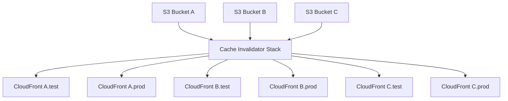

# Serverless CloudFront Distribution Cache Invalidation

> For use with template-pipeline.yml which can be deployed using [Atlantis Configuration Repository for Serverless Deployments using AWS SAM](https://github.com/63Klabs/atlantis-cfn-configuration-repo-for-serverless-deployments)

An application that demonstrates Atlantis Platform Templates for provisioning a method to invalidate CloudFront caches when object are updated in an S3 bucket used to store static web content.

## Architecture

This application stack operates independently of S3 buckets hosting static web content and CloudFront distributions.

This solution actually requires at least three stacks:

1. S3 stack with Object Access Control and S3 Events
2. Central Cache Invalidator (this stack)
3. CloudFront Distribution with Route 53 (Route 53 optional)

This application stack can serve multiple S3 buckets and CloudFront distributions. Typically only one invalidation stack is required per `Prefix` (stack namespace) on an account and region.

Simply:

1. An object is uploaded to S3
2. An S3 event sends a notification to this application stack
3. This application stack gathers the recent events from the bucket and assemples an invalidation request.
4. Once the request is assembled, it finds the corresponding distribution that serves as the CDN for the S3 bucket.
5. It submits an invalidation request to the distribution.

> There can be multiple buckets and multiple distributions. The buckets only need to know the ARN of the endpoint to send an event to. This application will then dynamically determine what distribution to submit the invalidation to. (Uses resource tags as the look-up)

## Deployment

This stack is designed to be deployed using the [63Klabs Atlantis developer platform](https://github.com/63Klabs/atlantis-cfn-configuration-repo-for-serverless-deployments). 

Like any other project, you can skip the Atlantis platform and go at it on your own by modifying the code and templates to fit your needs. However, if you are managing many projects manually (especially on your own or part of a small team), the Atlantis platform is highly recommended as it implements Platform Engineering and AWS best practices. Plus it utilizes AWS native resources including SAM deployments and CloudFormation without the need of proprietary DevOps tools. Everything is API, CloudFormation template, and SAM CLI based. There are a lot of logging, metrics, and security features already baked into the templates so you don't need to start from scratch.

### Deployment Using 63Klabs Atlantis

Deploy using the Atlantis CLI scripts from your DevOps SAM Config repo:

```bash

## -------------------------
## CREATE THE REPO

# > From your organization's SAM CONFIG repo:

# Use the create_repo script to create, configure, and seed a repository
# With the Cache Invalidator
./cli/create_repo.py YOUR_GITHUB/YOUR_REPO_NAME --provider github
# -- OR -- if using CodeCommit:
./cli/create_repo.py YOUR_REPO_NAME --provider codecommit

# > Choose atlantis-starter-03-serverless-cloudfront-cache-invalidation
#   From the list of starter applications and follow the prompts

# > Copy the HTTPS URL

## -------------------------
## MERGE and PUSH to TEST BRANCH

# > Change OUT of the SAM CONFIG repo to where you clone app repos
cd .. # Be sure to do this OUTSIDE of the SAM CONFIG repo! Open a new terminal if necessary

# Clone your repository and perform your first deployment AS-IS just to make sure it works
git clone YOUR_REPO_HTTPS_URL
cd YOUR_REPO_NAME

# checkout dev
git checkout dev
# If you make any changes, ensure you commit and push the changes back to dev 
# (however, try a first-time deploy as-is to make troubleshooting easier)

# You must merge dev into test before creating the pipeline (so it has something to deploy)
git checkout test
git merge dev
git push

## -------------------------
## DEPLOY INVALIDATOR STACK - TEST

# Note: We will use the ProjectId of cdn-invalidator but it can be anything
#       For now we will just deploy a test instance of the stack and have
#       Our buckets and distributions use that.

# > These next commands MUST be done from the SAM CONFIG repo 
# Go back to your SAM CONFIG repo (or SAM CONFIG terminal if you kept it open)
cd ../YOUR_DEVOPS_SAM_CONFIG_REPO

# Create the test environment and deploy
./cli/config.py pipeline PREFIX cdn-invalidator test
# > When prompted:
#   Choose template-pipeline.yml (or template-pipeline-github.yml if deploying from a gh repo)
#   Follow the stack parameter prompts (leave S3StaticHostBucket blank)

# Don't forget to deploy if you skipped deployment during config
./cli/deploy.py pipeline PREFIX cdn-invalidator test

# You can follow the deployment in the web console
# After the Pipleline stack has deployed, it will deploy the Application stack
# Once the Invalidator Application stack has deployed, 
# Go to the Invalidator Application stack Output section in the web console
# > Copy CloudFrontCacheInvalidatorArn
# You will need this for your S3 bucket configuration

## -------------------------
## CREATE THE S3 BUCKET THAT WILL SERVE AS THE STATIC WEB HOST
## The bucket will store both test and prod static assets

./cli/config.py storage PREFIX MY_STATIC_ASSETS
# > CHOOSE TEMPLATE: template-storage-s3-oac-for-cloudfront.yml
# > SET PARAMETER: CloudFrontCacheInvalidatorArn
# > Copy the following from OUTPUTS
# - BucketName
# - OriginBucketDomainForCloudFront

# Don't forget to deploy if you skipped deployment during config
./cli/deploy.py storage PREFIX MY_STATIC_ASSETS

## -------------------------
## CREATE THE CLOUDFRONT DISTRIBUTIONS
## You do not need a domain name for testing

# Note: By design, cache invalidations are processed ONLY for PROD (stage, beta, prod) instances
# To fully test you will need both a TEST (test) and PROD (stage/beta/prod) instance

# Because the bucket uses OAC for security, you will need a cloudfront distribution
# A custom domain record in Route 53 is optional
# For now you can just use the CloudFront distribution url for testing and add a custom domain later

./cli/config.py network PREFIX YOUR_PROJECT_NAME test
# > Choose template-network-route53-cloudfront-s3-apigw.yml (it does not require api gateway)
# > SET PARAMETERS
# - You will need the OriginBucketDomainForCloudFront from the storage stack outputs
# > ADD NEW TAG: AllowInvalidationEvents=true

# Don't forget to deploy if you skipped deployment during config
./cli/deploy.py network PREFIX YOUR_PROJECT_NAME test

# All uploads to test/public are skipped, so to actually see invalidations you will need a PROD instance

# Use the same template and prompts answers as before. 
# Don't forget:
# - PARAMETER: OriginBucketDomainForCloudFront
# - ADD NEW TAG: AllowInvalidationEvents=true
./cli/config.py network PREFIX YOUR_PROJECT_NAME test
./cli/deploy.py network PREFIX YOUR_PROJECT_NAME test

## -------------------------
## TEST
## Using the resource list in the invalidator stack, you should be able to go 
## In via the console and check logs and queues. 
## (You will have a 5 minute window as events are processed in 5 minutes)
## Validate both test and prod behavior in 
## DynamoDb, SQS, Events, Lambda Logs and CloudFront Dist invalidation requests

# A test file is available in the root of this repo. Increment the target file name on each copy
aws s3 cp test.html s3://BUCKET_NAME/test/public/test-1.html
# - The Ingestor function should accept and then filter OUT the event (it is in test)
# Copy to S3 prod location
aws s3 cp test.html s3://BUCKET_NAME/prod/public/test-2.html
# The Ingestor function should accept and schedule an invalidation. It should be listed in SQS and DynamoDB
# The Processor function should kick in after 5 minutes and submit an invalidation
```

### Deployment Without 63Klabs Atlantis

You will have to have a firm understanding of multi-stack, micro-service architecture as well as permissions and template configuration.

If this is your first time deploying to AWS, or deployments have been difficult to manage in the past and you are looking into automating some of your tasks, please look at 63Klabs Atlantis. (If you traditionally deploy applications through the Web Console, PLEASE look into Atlantis or at least Infrastructure as Code! We have many, many [tutorials to get you started](https://github.com/63Klabs/atlantis-tutorials) deploying production-ready applications!) using Platform Engineering and CI/CD best practices.

If you have a process that works or are using Terraform or other workflow to manage your deployments, then modify the template and function to suit your needs. You can use the template and configurations as guides.

## Production

The invalidator service is a CENTRAL function that accepts events from MULTIPLE buckets and can process and submit requests to MULTIPLE CloudFront distributions.



The above commands using the Atlantis CLI scripts only deployed a TEST instance of the invalidator. When ready to use it in production you should deploy a production instance and reconfigure your S3 buckets to use the invalidator's production ARN. 

It is useful to keep a test instance of the invalidator for testing any custom changes. To have the S3 bucket submit events to a different invalidator instance just re-run the `config.py` script for that storage stack and set the `CloudFrontCacheInvalidatorArn` parameter to point to the alternate instance.

To remove invalidation from your storage stack just re-run the `config.py` script fo that storage stack and leave the `CloudFrontCacheInvalidatorArn` blank by entering a dash `-` (otherwise it will remain the set value).

## Tutorials

Read the [Atlantis Tutorials introductory page](https://github.com/63Klabs/atlantis-tutorials) for usage information.

## AI Context

See [AI_CONTEXT.md](AI_CONTEXT.md) for important context and guidelines for AI-generated code in this repository.

The context file is also helpful (and perhaps essential) for HUMANS developing within the application's structured platform as well.
