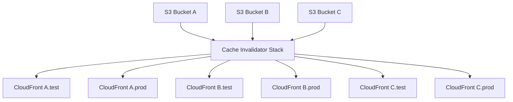

# Serverless CloudFront Distribution Cache Invalidation

> For use with template-pipeline.yml which can be deployed using [Atlantis Configuration Repository for Serverless Deployments using AWS SAM](https://github.com/63Klabs/atlantis-cfn-configuration-repo-for-serverless-deployments)

An application that demonstrates Atlantis Platform Templates for provisioning a method to invalidate CloudFront caches when object are updated in an S3 bucket used to store static web content.

## Architecture

This application stack operates independently of S3 buckets hosting static web content and CloudFront distributions.

This solution actually requires at least three stacks:

1. S3 stack with Object Access Control and S3 Events
2. Central Cache Invalidator (this stack)
3. CloudFront Distribution with Route 53 (Route 53 optional)

This application stack can serve multiple S3 buckets and CloudFront distributions. Typically only one invalidation stack is required per `Prefix` (stack namespace) on an account and region.

Simply:

1. An object is uploaded to S3
2. An S3 event sends a notification to this application stack
3. This application stack gathers the recent events from the bucket and assemples an invalidation request.
4. Once the request is assembled, it finds the corresponding distribution that serves as the CDN for the S3 bucket.
5. It submits an invalidation request to the distribution.

> There can be multiple buckets and multiple distributions. The buckets only need to know the ARN of the endpoint to send an event to. This application will then dynamically determine what distribution to submit the invalidation to. (Uses resource tags as the look-up)

## Deployment

See [DEPLOYMENT_GUIDE.md](./DEPLOYMENT_GUIDE.md) for deployment instructions.

## Production

The invalidator service is a CENTRAL function that accepts events from MULTIPLE buckets and can process and submit requests to MULTIPLE CloudFront distributions.

The above commands using the Atlantis CLI scripts only deployed a TEST instance of the invalidator. When ready to use it in production you should deploy a production instance and reconfigure your S3 buckets to use the invalidator's production ARN. 

It is useful to keep a test instance of the invalidator for testing any custom changes. To have the S3 bucket submit events to a different invalidator instance just re-run the `config.py` script for that storage stack and set the `CloudFrontCacheInvalidatorArn` parameter to point to the alternate instance.

To remove invalidation from your storage stack just re-run the `config.py` script fo that storage stack and leave the `CloudFrontCacheInvalidatorArn` blank by entering a dash `-` (otherwise it will remain the set value).

## Tutorials

Read the [Atlantis Tutorials introductory page](https://github.com/63Klabs/atlantis-tutorials) for usage information.

## AI Context

See [AI_CONTEXT.md](AI_CONTEXT.md) for important context and guidelines for AI-generated code in this repository.

The context file is also helpful (and perhaps essential) for HUMANS developing within the application's structured platform as well.
